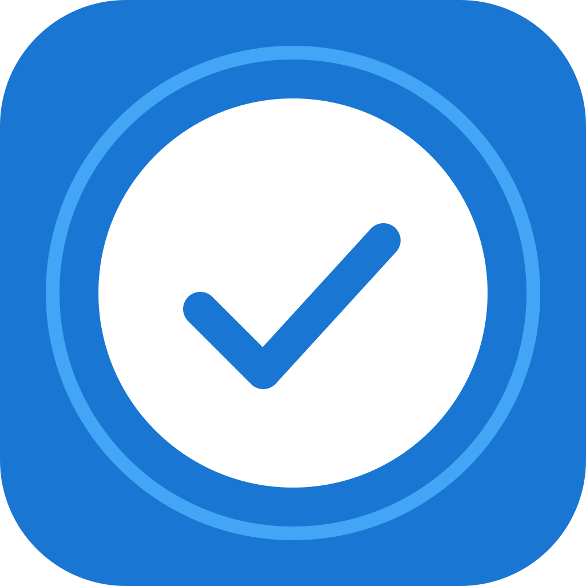

# Wat Do - Flutter To Do List

A beautiful, responsive, and multiplatform To Do List app built with Flutter. Supports Android, iOS, and Web with a modern UI and secure automated CI/CD for releases.

## Features
- Responsive UI for mobile, web, and desktop
- Add, view, and manage daily tasks
- Modern card-based design and smooth animations
- Secure build, sign, and release workflow (GitHub Actions)
- App icons and Play Store assets auto-generated
- English & Indonesian descriptions and release notes
- Hive local storage (platform-safe, works on web)

## Getting Started

1. **Clone the repo:**
   ```sh
   git clone <repo-url>
   cd todoflutter
   ```
2. **Install dependencies:**
   ```sh
   flutter pub get
   ```
3. **Run on Web:**
   ```sh
   flutter run -d chrome
   ```
4. **Run on Android/iOS:**
   ```sh
   flutter run
   ```

## Build & Release (CI/CD)
- Automated GitHub Actions workflow for building, signing, and releasing APK/AAB.
- Keystore and key.properties managed via GitHub Secrets.
- Artifacts uploaded to GitHub Releases.

## Screenshots


## License
MIT

---

### Bahasa Indonesia
Aplikasi To Do List multiplatform dengan tampilan modern dan workflow rilis otomatis. Dukungan penuh untuk Android, iOS, dan Web.

---

For more info, see the [CHANGELOG.md](CHANGELOG.md).
